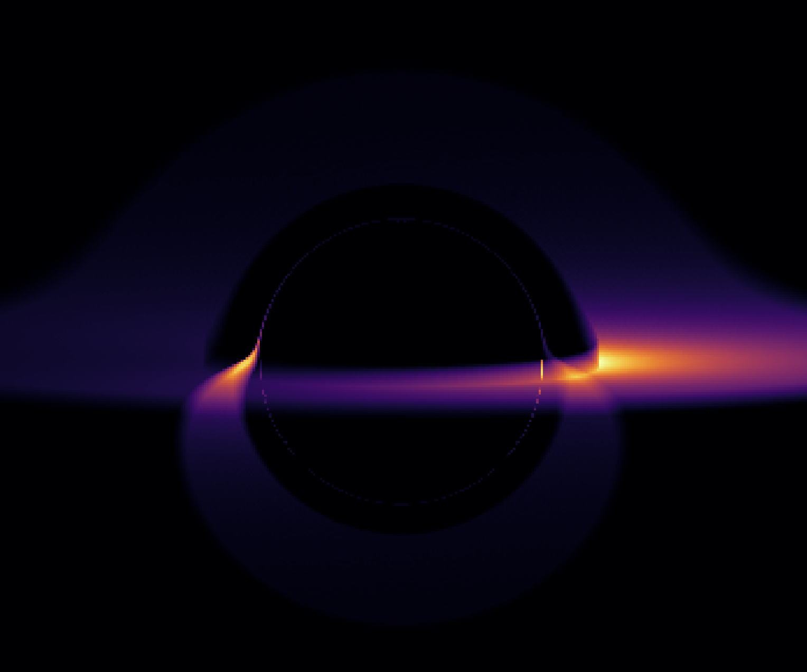

# Black Hole Ray Tracer

A lightweight, fully vectorized Python simulation of a black hole's accretion disk using relativistic ray tracing. 

This project models the visual distortions caused by the extreme gravitational pull of a black hole, including gravitational lensing and relativistic Doppler beaming, strictly using standard scientific libraries.



## Features

* **Physics Engine:** Simulates light trajectories around a Schwarzschild (non-rotating) black hole using approximations of General Relativity.
* **Doppler Beaming:** Calculates asymmetrical luminosity in the accretion disk (one side appears brighter due to relativistic speeds approaching the observer).
* **Fully Vectorized:** Leverages `numpy` array operations to compute thousands of light rays simultaneously, avoiding slow Python `for` loops.
* **Production-Ready Code:** Object-Oriented design, strict type hinting (PEP 484), and clean code architecture.

## Requirements

The project relies on standard scientific Python packages:

```bash
pip install numpy matplotlib
```

Usage
Simply run the main script. The BlackHoleRenderer class is pre-configured with solar mass equivalents and optimal viewing angles.

python black_hole.py

Customizing the Simulation
You can easily tweak the simulation parameters by instantiating the BlackHoleRenderer with different arguments:

from black_hole import BlackHoleRenderer, show_image

# Create a black hole with double the mass and a higher resolution
renderer = BlackHoleRenderer(
    mass=3.978e30,       # 2x Solar masses
    resolution=500,      # 500x500 pixels
    camera_angle_deg=10.0, 
    steps=500
)

image_data = renderer.render()
show_image(image_data, extent_limit=renderer.screen_size)


How it Works :
Initialization: The camera launches a grid of virtual photons (light rays) towards the black hole at speed c.
Ray Tracing (Euler Integration): At each time step, the angular momentum of each ray is calculated. The gravitational acceleration is derived and applied to the velocity vectors, bending the light around the singularity.
Accretion Disk Intersection: If a ray's trajectory passes through the thin plane of the accretion disk (3R s<r<10Rs), it accumulates intensity.
Relativistic Doppler Effect: The Keplerian orbital velocity of the disk is calculated. Light moving towards the camera is blueshifted (brighter), and light moving away is redshifted (dimmer).

Roadmap / Future Improvements

While the current engine is fast and visually accurate, future iterations could include:
- Runge-Kutta 4 (RK4) Integration: Replacing the current Euler method for higher long-term orbital stability.
- Kerr Metric: Implementing a rotating black hole model instead of the static Schwarzschild metric.
- Color Mapping: Translating the raw intensity data into specific temperature-based color spectrums (blackbody radiation).
